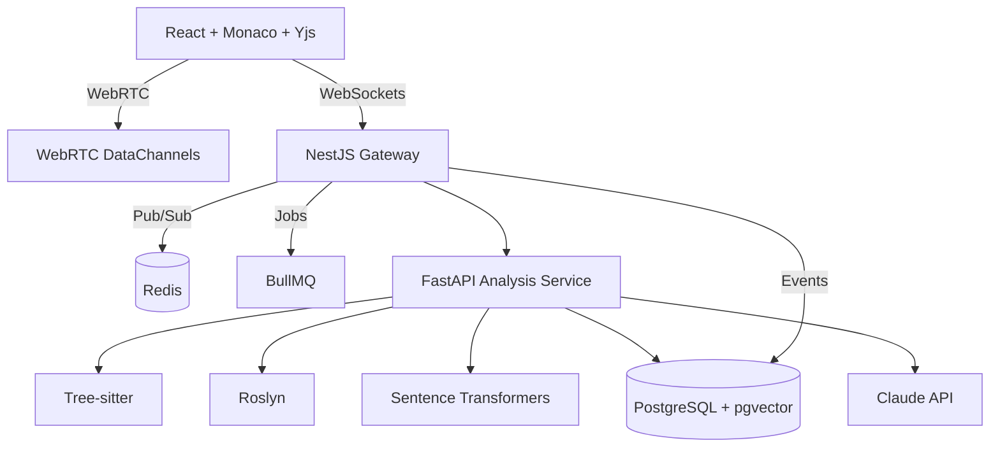

# Real-Time Collaborative Code Analysis Platform

A blueprint for a senior-level, real-time collaborative code review system that combines CRDT-based editing, AI-assisted insights, and automated architecture visualization.

## Goals
- Enable teams to review codebases collaboratively with live cursors, comments, and synchronized edits.
- Provide AI-assisted insights (refactoring suggestions, risk hotspots, architectural drift alerts).
- Generate dependency graphs and architecture diagrams in near real time.
- Offer semantic search across repositories using embeddings.

## High-Level Architecture



## Core Components

### 1) Real-Time Collaboration Engine (OT/CRDT)
- **Yjs** powers CRDT-backed shared documents in Monaco.
- **Awareness API** propagates cursors, selections, and presence.
- **Conflict resolution** is handled by CRDT merge semantics, with optional server snapshots for persistence.
- **Scaling** via WebSocket + Redis pub/sub, with WebRTC for low-latency peer-to-peer edits when available.

### 2) LSP Aggregator
- Multi-language LSP proxy that multiplexes requests from the frontend to language servers.
- Maintains per-repo language server pools with smart lifecycle management (idle shutdown, warm starts).
- Normalizes diagnostics, hover, and references into a common schema for cross-language UI.

### 3) Static Analysis & Architecture Visualization
- **Tree-sitter** parses supported languages with incremental parsing.
- **Custom AST walkers** build dependency graphs and detect architectural patterns (layered, hexagonal, modular monolith).
- **Roslyn** handles C# solutions for robust semantic data.
- Emits graph data for visualization (Mermaid, Cytoscape, or D3).

### 4) Semantic Search & AI Insights
- **Sentence-transformers** generates embeddings for code blocks, symbols, and docs.
- **pgvector** stores embeddings for fast similarity search.
- **Claude API** provides summarization, refactor recommendations, and review insights.

## Suggested Repository Layout

```
/apps
  /frontend        # React + Monaco + Yjs
  /realtime-api    # NestJS WebSocket gateway
  /analysis-api    # FastAPI service
/packages
  /lsp-aggregator  # Shared LSP router and adapters
  /analysis-core   # AST walkers, graph builders
  /shared-types    # Common DTOs
/infra
  /docker          # docker-compose + local dev configs
  /ecs             # ECS task defs, services
```

## Data Flow (Edit Session)
1. User opens a file in Monaco; Yjs doc syncs via WebRTC or WebSocket.
2. Cursor/presence updates broadcast through Yjs awareness and Redis pub/sub.
3. On save or debounce, file diff is sent to FastAPI analysis service.
4. Analysis service updates dependency graphs and emits insights.
5. Semantic search index updates in pgvector.

## Real-Time Strategies
- **Debounce** expensive analysis (e.g., 500ms idle window).
- **Throttling** presence updates to avoid flooding.
- **Lazy-load** architecture visualization for large repos.

## Deployment
- Local dev via Docker Compose: Postgres + pgvector, Redis, API services, and frontend.
- Production on AWS ECS Fargate with RDS Postgres + pgvector.

## Quickstart (Local)
1. Install dependencies per workspace (frontend, realtime-api).
2. Start the realtime gateway:
   - `npm --prefix apps/realtime-api run start`
3. Start the analysis API:
   - `uvicorn apps/analysis-api/main:app --reload --port 8000`
4. Start the frontend:
   - `npm --prefix apps/frontend run dev`

## Docker Compose (Infra Services)
```bash
docker compose -f infra/docker/docker-compose.yml up --build
```

## Next Steps
- Wire Yjs awareness to the NestJS gateway for presence and cursor events.
- Build a minimal LSP aggregator for TypeScript + Python as a first milestone.
- Add Tree-sitter analysis for JS/TS, then extend to Python and C#.
